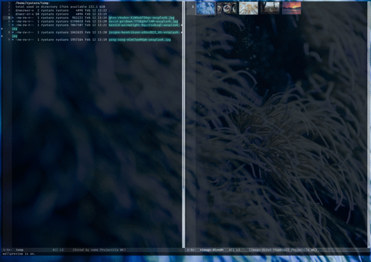

# wallpreview
## Abstract
The wallpreview is an Emacs package.
It allows you to preview images and set the selected one as the wallpaper in the image-dired mode.

A running example is as below.



## Installation

You can install it from Melpa.

## Usage

Toggle wallpreview if type `wallpreview-toggle-key`(`w` is the default key) in `*image-dired*`.
When you select an image, wallpreview pass the path of the image to `wallpreview-wallpaper-cmd`.
You can configure `wallpreview-wallpaper-cmd` to make it change the wallpaper of your environment.
`#'wallpreview--sway-bg` binds `wallpreview-wallpaper-cmd` as defaut, and the defintion is as below.

```
(defun wallpreview--set-wallpaper (&optional arg)
  "Set a background as ARG.
If arg is nil, use the forcused image."
  (interactive "fBackground image: ")
  (let ((wallpaper-path (or arg (image-dired-original-file-name))))
    (call-process-shell-command
     (concat (apply wallpreview-wallpaper-cmd (list wallpaper-path)) "&")
     nil 0)))
```

`M-x wallpreview-open-wallpaper-directory` opens `wallpreview-wallpaper-directory` in `image-dired`,
and turns on `wallpreview`.
